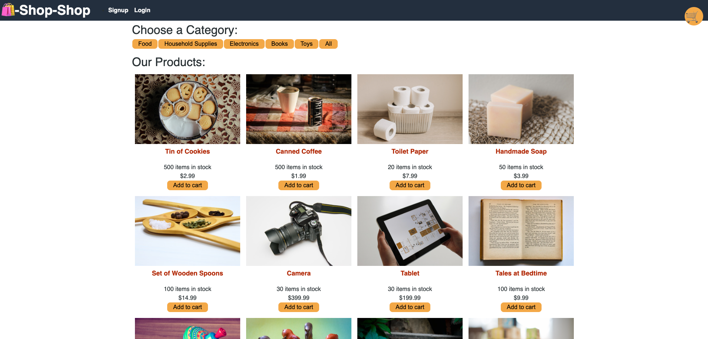
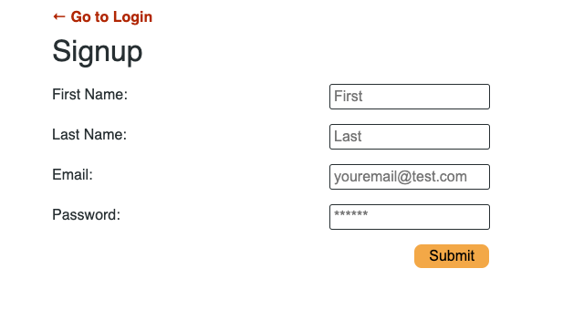
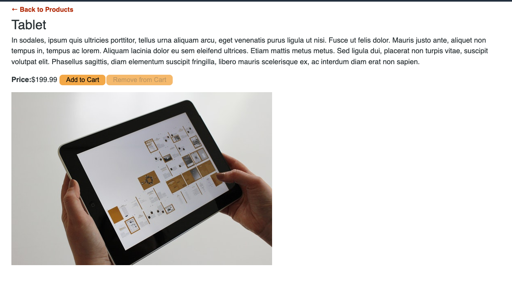
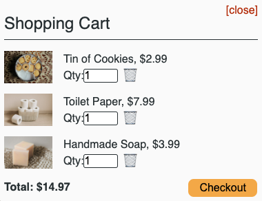
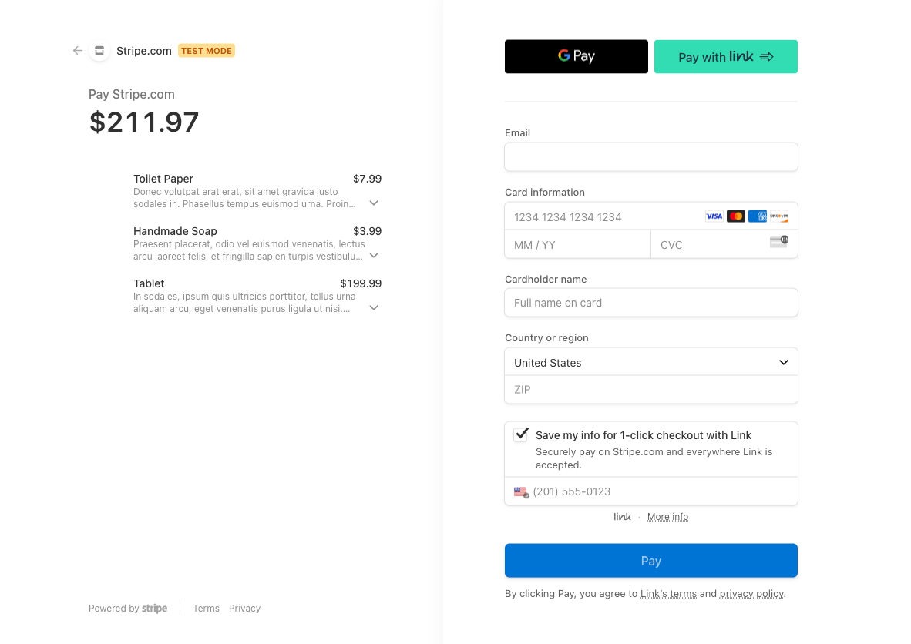

# Redesigned-Happiness

## Description

In this project, I refactored an e-commerce platform from an activity we performed in bootcamp so that it uses Redux. 

From the Redux website:

Redux helps you write applications that behave consistently, run in different environments, and are easy to test.

Redux helps you deal with shared state management, but like any tool, it has tradeoffs. It's not designed to be the shortest or fastest way to write code. It's intended to help answer the question "When did a certain slice of state change, and where did the data come from?", with predictable behavior. There are more concepts to learn, and more code to write. It also adds some indirection to your code, and asks you to follow certain restrictions. It's a trade-off between short term and long term productivity.

## Table of Contents

- [Installation](#Installation)
- [Useage](#Useage)
- [Credits](#Credits)
- [License](#License)
- [Questions](#Questions)

## Installation

Run the following commands in your integrated terminal to start the application locally.
"npm install"
"npm build"
"npm run seed"
"npm develop"

OR

Visit the deployed Render site at:

https://redesigned-happiness.onrender.com

## Useage

Visit the site. 

Sign up or login. Note, you can still browse for items and add them to your cart but you must be signed up and logged in to make purchases.

Search for products and add them to your cart, click on the individual product links to get more information on a specific product.

As you add items to the cart, the cart will show you its contents.

You can always check the current contents of your cart by clicking the cart icon in the top right corner.

When you are ready to checkout - click the checkout button in the shopping cart and you will be redirected to the stripe page to enter payment information.

## Credits

Thank you to my bootcamp instructors, Roger and Sasha for the instruction that allowed me to build my app.

## License

MIT License

## Questions

https://github.com/coulterkyle

For questions regarding this app, contact me at:

e-mail: kcoulter2002@gmail.com